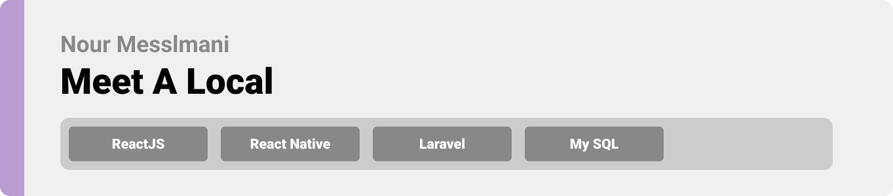
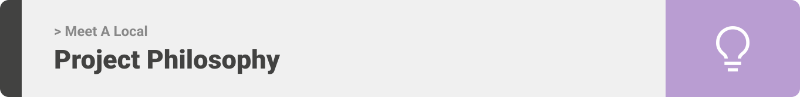
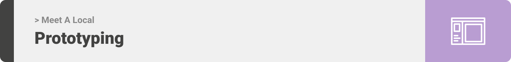

<div align="center">

> Hello world! This is the project’s summary that describes the project plain and simple, limited to the space available. 


**[PROJECT PHILOSOPHY](https://github.com/julescript/well_app#-project-philosophy) • [WIREFRAMES](https://github.com/julescript/well_app#-wireframes) • [TECH STACK](https://github.com/julescript/well_app#-tech-stack) • [IMPLEMENTATION](https://github.com/julescript/well_app#-impplementation) • [HOW TO RUN?](https://github.com/julescript/well_app#-how-to-run)**

</div>

<br><br>




> Meet A Local app is a social media app which aims to connect foreigners to locals in any place in the world. Foreigners can browse locals and filter them, moreover they can find them on map using google maps feature. 
> Locals are able to create events which users can browse and filter
>Foreigners are able to visit locals profile page and chat with them

### Foreigners Stories
- As a foreigner, I want to browse locals in the country I'm living in
- As a foreigner, I want to view locals on a map and check their locations
- As a foreigner, I want to browse and save events organized by locals
- As a foreigner, I want to able to chat with locals
- As a foreigner, I want to able to create posts

<br><br>
### Locals Stories
- As a local, I want foreigners to reach out for me
- As a local, I want create new events
- As a local, I want to able to create posts 

<br><br>
### Admin Stories
- As an admin, I want to view all users
- As an admin, I want to view statistics and data about the app
- As an admin, I want to be able to ban/unban users

<br><br>


> This design was planned before on paper, then moved to Figma app for the fine details.
Note that i didn't use any styling library or theme, all from scratch and using pure css modules

| Sign In  | Sign Up  |
| -----------------| -----|
| ![Landing] | ![Home/Search] |

| Sign Up  | Sign Up  |
| -----------------| -----|
| ![Artists results] | ![Artist's Albums] |


<br><br>


Here's a brief high-level overview of the tech stacks the app uses:
<br><br>
This project uses the React Native framework. React Native (also known as RN) is a popular JavaScript-based mobile app framework that allows you to build natively-rendered mobile apps for iOS and Android. 
<br><br>
The framework lets you create an application for various platforms by using the same codebase.
<br><br>
The backend is implemented using Laravel which is a free and open-source PHP web framework, intended for the development of web applications following the model–view–controller (MVC) architectural pattern.
<br><br>
For storing messages, the app uses the Firebase package which is a Google-backed application development software that enables developers to develop iOS, Android and Web apps. Firebase Realtime Database is a cloud-hosted NoSQL database that enables data to be stored and synced between users in real time.
<br><br>
React-native-maps is used to display user's and locals locations, and autocomplete service is used to fill the names of a place being searched for


<br><br>


> Uing the above mentioned tecch stacks and the wireframes build with figma from the user sotries we have, the implementation of the app is shown as below, these are screenshots from the real app

| Landing  | Home/Search  |
| -----------------| -----|
| ![Landing] | ![Home/Search] |


<br><br>


> This is an example of how you may give instructions on setting up your project locally.
To get a local copy up and running follow these simple example steps.

### Prerequisites

This is an example of how to list things you need to use the software and how to install them.
* npm
  ```sh
  npm install npm@latest -g
  ```

### Installation


