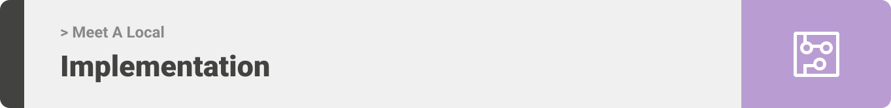

<div align="center">

> Hello world! This is the project’s summary that describes the project plain and simple, limited to the space available. 


**[PROJECT PHILOSOPHY](https://github.com/noormesslmani/MeetALocal#-project-philosophy) • [WIREFRAMES](https://github.com/noormesslmani/MeetALocal#-wireframes) • [TECH STACK](https://github.com/noormesslmani/MeetALocal#-tech-stack) • [IMPLEMENTATION](https://github.com/noormesslmani/MeetALocal#-implementation) • [HOW TO RUN?](https://github.com/noormesslmani/MeetALocal#-how-to-run)**

</div>

<br><br>


> Since there is no better way to learn about a country other than meeting with people who actually live in that country, Meet A Local aims to provide foreigners with a unique authentic experience and to let them feel home. 
> Meet A Local app is all about connecting locals with foreigners in any place in the world!  
> Foreigners can browse locals and book them, moreover they can find them on map using google maps feature. 
> Locals are able to create events which users can browse and book.
> Users are able to visit each others profile pages and chat with each others

### Foreigners Stories
- As a foreigner, I want to browse locals and filter them by country and categories
- As a foreigner, I want to view locals on the map and check their locations
- As a foreigner, I want to browse, save, and book events organized by locals
- As a foreigner, I want to able to chat with locals and book an oppointment with them
- As a foreigner, I want to able to create posts and add comments

<br><br>
### Locals Stories
- As a local, I want foreigners to reach out for me
- As a local, I want create new events
- As a local, I want to able to create posts and add comments

<br><br>
### Admin Stories
- As an admin, I want to view all users
- As an admin, I want to view statistics and data about the app
- As an admin, I want to be able to ban/unban users

<br><br>


> This design was planned before on paper, then moved to Figma app for the fine details.
Note that i didn't use any styling library or theme, all from scratch and using pure css modules

- Mobile App

| Sign In  | Sign Up  | User Type  |
| -----------------| ----------------| ----------------|
|  |  |  |

| Home  | Locals  | Posts  |
| --------------| ------------| ------------|
|  |  |   |

| Events  | Chats  | Maps  |
| --------------| ------------| ------------|
|  |  |   |


- Admin Panel

| Log In  | App Statistics  | Users' Table  |
| --------------| ------------| ------------|
|  |  |   |


<br><br>


Here's a brief high-level overview of the tech stacks the app uses:
<br><br>
- This project uses the [React Native framework](https://reactnative.dev/). React Native (also known as RN) is a popular JavaScript-based mobile app framework that allows you to build natively-rendered mobile apps for iOS and Android. The framework lets you create an application for various platforms by using the same codebase.
<br><br>
- The backend is implemented using [Laravel](https://laravel.com/) which is a free and open-source PHP web framework, intended for the development of web applications following the model–view–controller (MVC) architectural pattern.
<br><br>
- For Database the project uses [MySQL](https://www.mysql.com/) database, which is a relational database management system based on the Structured Query Language.
<br><br>
- For storing messages, the app uses the [Firebase](https://firebase.google.com/) package which is a Google-backed application development software that enables developers to develop iOS, Android and Web apps. Firebase Realtime Database is a cloud-hosted NoSQL database that enables data to be stored and synced between users in real time.
<br><br>
- Admin's panel was built using [React](https://reactjs.org/). React is a free and open-source front-end JavaScript library for building user interfaces based on UI components.
<br><br>
- To display Locations [React-native-maps](https://docs.expo.dev/versions/latest/sdk/map-view/) is used in the mobile app, and [Leaflet's](https://leafletjs.com/) open source map is used in admin's website. Moreover, [Google Maps API](https://developers.google.com/maps/documentation/places/web-service/overview) is used for places search service.


<br><br>


> Uing the above mentioned tech stacks and the wireframes build with figma from the user sotries we have, the implementation of the app is shown as below, these are screenshots from the real app


### Local:
---------------

| Registration  | Event creation  |  Notifications | 
| ----------| ----------| ----------| 
|  |  |  | 

|  Appointment creation/deletion | Profile  | 
| ----------| ----------|
|  |  |


### Foreigner:
---------------

| Browse Locals  | Browse Events  | Profile  |
| ----------| ----------| ----------| 
|  |  |  | 


| Local's profile | Locations on Map | Search |
| ----------| ----------| ----------|
|  |  |  | 


### Common:
---------------

| Chat Room  | Post  | Comments  |
| ----------| ----------| ----------| 
|  |  |  | 
 

### Admin:
---------------
| Log In  | Users Tables  | 
| ----------| ----------| 
|  |  |

| Statistics  | Map  |
| ----------| ----------| 
|  |  | 

<br><br>


> This is an example of how you may give instructions on setting up your project locally.
To get a local copy up and running follow these simple example steps.


### Prerequisites

- Download and Install [Node.js](https://nodejs.org/en/)
- Download and Install [Composer](https://getcomposer.org/download/)
- Download and Install [XAMPP](https://www.apachefriends.org/download.html)

- npm
  ```sh
  npm install npm@latest -g
  ```
- Expo CLI
  ```sh
  npm install --global expo-cli


### Installation

1. Clone the repo

   ```sh
   git clone https://github.com/noormesslmani/MeetALocal.git
   ```
#### To Run The Mobile App

1. Navigate to MeetALocal-rn folder and install dependencies
   ```sh
   cd MeetALocal/MeetALocal-rn
   npm install
   ```
2. Run the start up command
   ```sh
   npm start
   ```
3. Scan the generated QR code with your camera (ios) or through the Expo Go application (android)

#### To Run The Desktop App

1. Navigate to admin-panel folder and install dependencies
   ```sh
   cd MeetALocal/admin-panel
   npm install
   ```
2. Run the start up command
   ```sh
   npm start
   ```

#### To Run Laravel Server on your machine

1. Create a database locally named meetalocaldb

2. Navigate to the backend folder
   ```sh
   cd MeetALocal/MeetALocal-Backend
   ```
3. Inside the .env file in your backend folder
   - Insert the db name as follow -> DB_DATABASE= -> DB_DATABASE=meetalocal
   
4. Run migration
   ```sh
   php artisan migrate
   ```
5. Run the seeder
   ```sh
   php artisan db:seed
   ```
6. Start the Server
   ```sh
   php artisan serve
   ```


